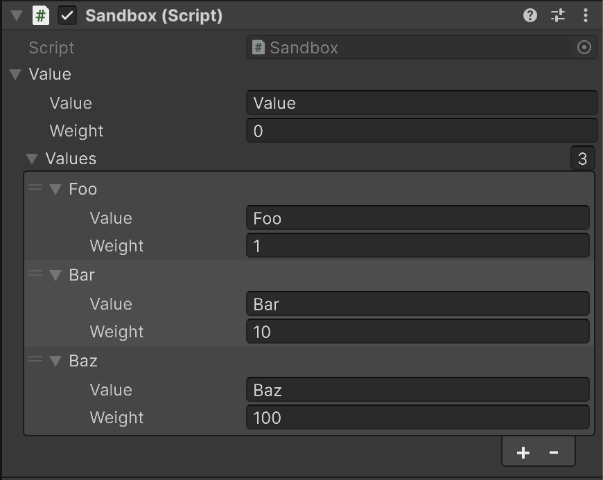

# NRandom

[](https://www.nuget.org/packages/NRandom)
[](https://github.com/nuskey8/NRandom/releases)
[](./LICENSE)

[English]((./README.md)) | 日本語

## 概要

NRandomは.NET/Unity向けに擬似乱数生成の機能を提供するライブラリです。

.NETには標準の`Random`クラスが存在しますが、その機能は十分ではなく、また互換性の問題から複雑な実装や不要な抽象化が多く残されています。

Unityの`UnityEngine.Random`はstaticクラスであるためインスタンス化できず、内部で状態管理を行うため乱数の再現が難しい問題があります。

NRandomでは新たな乱数生成の抽象レイヤーとして`IRandom`を導入し、複数のアルゴリズム(xoshift, xoshiro, splitmix, PCG, etc.)に基づく高速な実装を提供します。また、`System.Numerics`やUnityの型に対応した拡張メソッド、重み付き乱数を扱うための`IWeightedCollection<T>`、乱数に対応したLINQの拡張(`RandomEnumerable`)など、乱数を取り扱う上で便利な多くの機能を用意しています。

> [!WARNING]
> このライブラリをセキュリティ目的で使用しないでください。暗号的に安全な乱数が必要な場合は`System.Security.Cryptography.RandomNumberGenerator`の利用を推奨します。

## インストール

### NuGet packages

NRandomを利用するには.NET Standard2.1以上が必要です。パッケージはNuGetから入手できます。

### .NET CLI

```ps1
dotnet add package NRandom
```

### Package Manager

```ps1
Install-Package NRandom
```

### Unity

NugetForUnityを用いることでUnityでNRandomを利用可能です。詳細は[Unity](#unity-1)の項目を参照してください。

## 基本的な使い方

`RandomEx.Shared`を用いて乱数の生成を行うことができます。

```cs
using NRandom;

// 0-9までのランダムな値を取得
var n = RandomEx.Shared.NextInt(0, 10);

// trueまたはfalseをランダムに取得
var flag = RandomEx.Shared.NextBool();
```

また`RandomEx.Create()`を用いることで、ランダムなシードで初期化された`IRandom`のインスタンスを作成できます。

```cs
// インスタンスを作成
var rand = RandomEx.Create();

// [0.0, 1.0)のランダムな値を取得
var d = rand.NextDouble();
```

> [!WARNING]
> `RandomEx.Shared`はスレッドセーフですが、`RandomEx.Create()`で作成したインスタンスやその他の`IRandom`を実装したクラスはスレッドセーフではありません。

## 対応する型

NRandomは`System.Random`よりもさらに多くの型に対応しています。

```cs
var rand = RandomEx.Create();

// int
rand.NextInt();                 // [int.MinValue, int.MaxValue]
rand.NextInt(10);               // [0, 10)
rand.NextInt(10, 20);           // [10, 20)

// uint
rand.NextUInt();                // [0, uint.MaxValue]
rand.NextUInt(10);              // [0, 10)
rand.NextUInt(10, 20);          // [10, 20)

// long
rand.NextLong();                // [long.MinValue, long.MaxValue]
rand.NextLong(10);              // [0, 10)
rand.NextLong(10, 20);          // [10, 20)

// ulong
rand.NextULong();               // [0, ulong.MaxValue]
rand.NextULong(10);             // [0, 10)
rand.NextULong(10, 20);         // [10, 20)

// float
rand.NextFloat();               // [0f, 1f)
rand.NextFloat(10f);            // [0f, 10f)
rand.NextFloat(10f, 20f);       // [10f, 20f)

// double
rand.NextDouble();              // [0.0, 1.0)
rand.NextDouble(10.0);          // [0.0, 10.0)
rand.NextDouble(10.0, 20.0);    // [10.0, 20.0)
rand.NextDoubleGaussian();      // 平均0.0、標準偏差1.0の正規分布の乱数を取得

// byte[], Span<byte>
rand.NextBytes(buffer);          // バッファをランダムなbyte列で埋める
```

また、拡張パッケージを導入することで`System.Numerics`、Unityの型に対応したメソッドを利用することも可能です。詳細は[System.Numerics](#systemnumerics)と[Unity](#unity-1)の項目を参照してください。

## シャッフル

`Shuffle()`メソッドを使用して配列の要素をシャッフルできます。

```cs
var array = new int[] { 0, 1, 2, 3, 4, 5 };

// 配列の要素をシャッフル
rand.Shuffle(array);
```

このメソッドは配列自体を書き換えます。副作用のないシャッフルについては以下のLINQの拡張を利用してください。

### LINQの拡張

`NRandom.Linq`名前空間以下には、乱数を利用した`IEnumerable<T>`の拡張が用意されています。

```cs
using System;
using System.Linq;
using NRandom.Linq;

var sequence = Enumerable.Range(0, 100);

// ランダムな要素を取得
var r = sequence.RandomElement();

// NRandomを利用したShuffle()
foreach (var item in sequence.Shuffle(RandomEx.Shared))
{
    Console.WriteLine(item);
}

// [0, 9]の範囲のランダムな値を10回流すIEnumerable<T>を作成
foreach (var item in RandomEnumerable.Repeat(0, 10, 10))
{
    Console.WriteLine(item);
}
```

これらのメソッドには乱数の取得に使用する`IRandom`を渡すことも可能です。指定がない場合は`RandomEx.Shared`が使用されます。

```cs
var rand = RandomEx.Create();

// 渡したrandインスタンスを用いて要素を取得
var r = sequence.RandomElement(rand);
```

## 重み付きコレクション

`NRandom.Collections`名前空間以下には重み付きの要素を保持するコレクションが用意されています。

```cs
// 重み付きコレクションのインターフェース
public interface IWeightedCollection<T> : IReadOnlyCollection<WeightedValue<T>>
{
    void GetRandom<TRandom>(TRandom random, Span<T> destination) where TRandom : IRandom;
}

// 重み付き要素を表す構造体
public record struct WeightedValue<T>(T Value, double Weight);
```

以下に`WeightedList<T>`を利用した重み付きの抽選のサンプルを示します。

```cs
// 重み付きリストを作成
var weightedList = new WeightedList<string>();

// 要素を重みを指定して追加
weightedList.Add("Legendary", 0.5);
weightedList.Add("Epic", 2.5);
weightedList.Add("Rare", 12);
weightedList.Add("Uncommon", 25);
weightedList.Add("Common", 60);

// 重み付きでランダムな要素を取得
var rarity = weightedList.GetRandom();
```

また、`RemoveRandom()`を利用して重複なしの重み付き抽選を行うことも可能です。

```cs
var list = new WeightedList<string>();
list.Add("Foo", 1.0);
list.Add("Bar", 1.5);
list.Add("Baz", 3.0);

list.RemoveRandom(out var item0);
list.RemoveRandom(out var item1);
list.RemoveRandom(out var item2);
```

## IRandom

NRandomでは乱数生成器のインターフェースとして`IRandom`を提供しています。これを実装することで独自の乱数生成器を作成できます。

```cs
public interface IRandom
{
    void InitState(uint seed);
    uint NextUInt();
    ulong NextULong();
}
```

### IRandomの実装

NRandomでは標準で多くの`IRandom`の実装が用意されています。以下にクラス名と内部で利用される擬似乱数のアルゴリズムの一覧を示します。

| クラス名 | アルゴリズム |
| - | - |
| `ChaChaRandom` | ChaCha (デフォルトはChaCha8) |
| `MersenneTwisterRandom` | Mersenne Twister (MT19937) |
| `Pcg32Random` | PCG32 (PCG-XSH-RR) |
| `Philox4x32Random` | Philox4x32 (デフォルトはPhilox4x32-10)  |
| `Sfc32Random` | SFC32  |
| `Sfc64Random` | SFC64  |
| `SplitMix32Random` | splitmix32 |
| `SplitMix64Random` | splitmix64 |
| `TinyMt32Random` | Tiny Mersenne Twister (32bit) |
| `TinyMt64Random` | Tiny Mersenne Twister (64bit) |
| `Xorshift32Random` | xorshift32 |
| `Xorshift64Random` | xorshift64 |
| `Xorshift128Random` | xorshift128 |
| `Xoshiro128StarStarRandom` | xoshiro128** |
| `Xoshiro256StarStarRandom` | xoshiro256** |

## NRandom.Algorithms

`NRandom.Algorithms`名前空間以下には擬似乱数の生成を行うアルゴリズムの実装が用意されています。

これらは最小限の状態とメソッドのみを持つ構造体であり、パフォーマンスが重要な場面や状態のシリアライズなどに役立ちます。

以下は`XorShift32`構造体を用いた擬似乱数生成のサンプルです。

```cs
using NRandom.Algorithms;

var seed = 123456;
var xorshift = new Xorshift32(seed);

var r = xorshift.Next();
```

## System.Numerics

`System.Numerics`名前空間以下の型に対応した拡張として、`NRandom.Numerics`パッケージがNuGetで提供されています。

#### .NET CLI

```ps1
dotnet add package NRandom.Numerics
```

#### Package Manager

```ps1
Install-Package NRandom.Numerics
```

`NRandom.Numerics`パッケージを導入することで、`Vector2`、`Vector3`、`Vector4`、`Quaternion`に対応した拡張メソッドが追加されます。

```cs
using System.Numerics;
using NRandom;
using NRandom.Numerics;

var rand = RandomEx.Create();

// Vector2
rand.NextVector2();
rand.NextVector2(new Vector2(10f, 10f));
rand.NextVector2(new Vector2(10f, 10f), new Vector2(20f, 20f));
rand.NextVector2Direction();    // ランダムな長さ1の方向ベクトルを取得
rand.NextVector2InsideCircle(); // 半径1の円の内側のランダムな座標を取得

// Vector3
rand.NextVector3();
rand.NextVector3(new Vector3(10f, 10f, 10f));
rand.NextVector3(new Vector3(10f, 10f, 10f), new Vector2(20f, 20f, 20f));
rand.NextVector3Direction();    // ランダムな長さ1の方向ベクトルを取得
rand.NextVector3InsideSphere(); // 半径1の球の内側のランダムな座標を取得

// Vector4
rand.NextVector4();
rand.NextVector4(new Vector4(10f, 10f, 10f, 10f));
rand.NextVector4(new Vector4(10f, 10f, 10f, 10f), new Vector2(20f, 20f, 20f, 20f));

// Quaternion
rand.NextQuaternionRotation();  // ランダムな回転を表すQuaternionを取得
```

## Unity

NRandomはUnityで使用可能なほか、Unity向けの拡張パッケージを提供しています。

### 要件

* Unity 2021.3 以上

### インストール

1. [NugetForUnity](https://github.com/GlitchEnzo/NuGetForUnity)をインストールします。

2. `NuGet > Manage NuGet Packages`からNuGetウィンドウを開き、`NRandom`パッケージを検索してインストールします。

3. `Window > Package Manager`からPackage Managerウィンドウを開き、`[+] > Add package from git URL`から以下のURLを入力します。

    ```
    https://github.com/nuskey8/NRandom.git?path=src/NRandom.Unity/Assets/NRandom.Unity
    ```

### 拡張メソッド

`NRandom.Unity`名前空間以下では、Unity向けに以下の拡張メソッドが用意されています。

```cs
using UnityEngine;
using NRandom;
using NRandom.Unity;

var rand = RandomEx.Create();

// Vector2
rand.NextVector2();
rand.NextVector2(new Vector2(10f, 10f));
rand.NextVector2(new Vector2(10f, 10f), new Vector2(20f, 20f));
rand.NextVector2Direction();    // ランダムな長さ1の方向ベクトルを取得
rand.NextVector2InsideCircle(); // 半径1の円の内側のランダムな座標を取得

// Vector3
rand.NextVector3();
rand.NextVector3(new Vector3(10f, 10f, 10f));
rand.NextVector3(new Vector3(10f, 10f, 10f), new Vector2(20f, 20f, 20f));
rand.NextVector3Direction();    // ランダムな長さ1の方向ベクトルを取得
rand.NextVector3InsideSphere(); // 半径1の球の内側のランダムな座標を取得

// Vector4
rand.NextVector4();
rand.NextVector4(new Vector4(10f, 10f, 10f, 10f));
rand.NextVector4(new Vector4(10f, 10f, 10f, 10f), new Vector2(20f, 20f, 20f, 20f));

// Quaternion
rand.NextQuaternionRotation();  // ランダムな回転を表すQuaternionを取得

// Color
rand.NextColor();
rand.NextColor(new Color(1f, 1f, 1f));
rand.NextColor(new Color(0f, 0f, 0f), new Color(1f, 1f, 1f));
rand.NextColorHSV(0f, 1f, 0f, 1f, 0f, 1f);          // HSVの範囲を指定
rand.NextColorHSV(0f, 1f, 0f, 1f, 0f, 1f, 0f, 1f);  // HSVとalphaの範囲を指定
```

### SerializableWeightedList

通常の`WeightedList<T>`とは別に、Inspectorで値を編集可能な`SerializableWeightedList<T>`が提供されています。

```cs
using NRandom;
using NRandom.Collections;
using NRandom.Unity;
using UnityEngine;

public class Sandbox : MonoBehaviour
{
    [SerializeField] WeightedValue<string> value;
    [SerializeField] SerializableWeightedList<string> list;
}
```



## ライセンス

このライブラリはMITライセンスの下に公開されています。